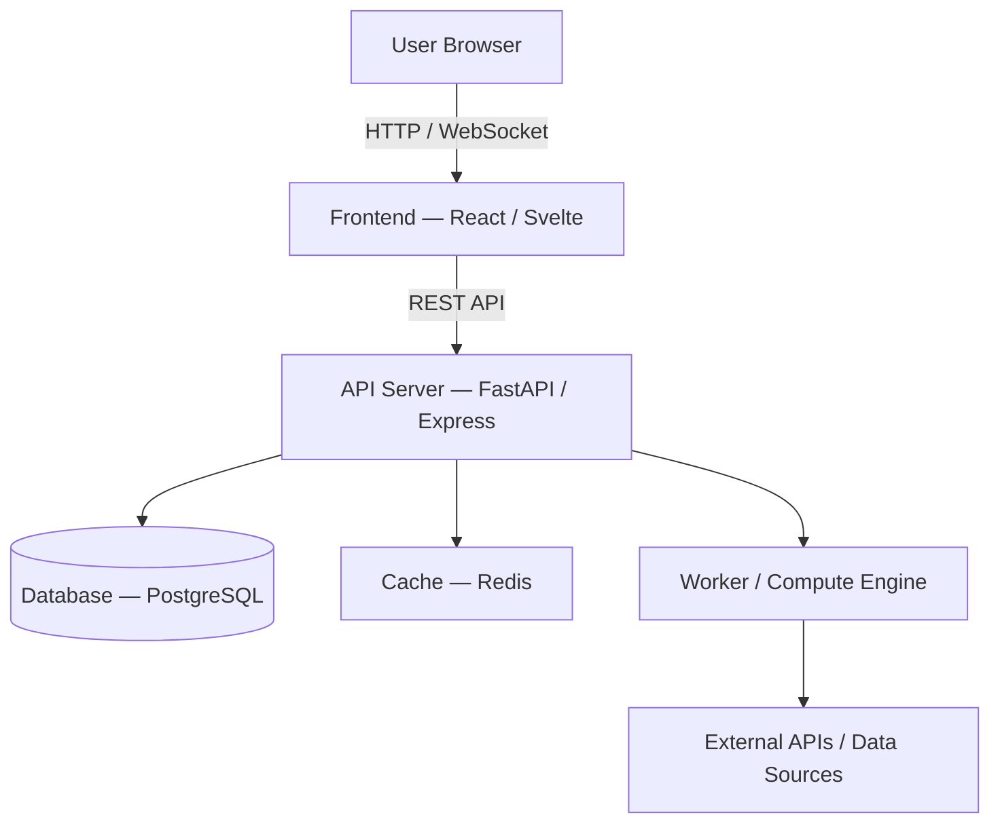

# IT Project Planner — Stage 4: Sprints, Jira Tasks & Architecture

**Language rule:** Respond in the same language the user writes in. All generated documents are in English.

---

## Input validation

Before starting, verify you have the Stage 3 output. You need:
- Project name
- Team composition (solo or team with roles) — from Stage 1 handoff
- Tech stack — from Stage 1 handoff
- User Stories US1–USN — from Stage 2
- Priority assignments per story (Prototype / MVP / v1.x / Backlog) — from Stage 3

If `[ProjectName]-mvp.md` or the MVP matrix is not available, ask:

> I need the Stage 3 MVP plan to generate the sprint breakdown. Either:
> - Paste the **Full Matrix** from `[ProjectName]-mvp.md` and the **Stage 1 Handoff Summary** from `[ProjectName]-requirements.md`, or
> - Run `/project-mvp [ProjectName]` first.

Do not proceed without the priority assignments. Do not invent sprint scope or story priorities.

---

## Scoping questions

Ask all four before generating:

> **1. Jira project key:** What short code should tasks use?
> (e.g., `FIN` for a finance app → tasks become `FIN-1`, `FIN-2` etc. — standard Jira format)
>
> **2. What do you want me to generate?**
> - **A) Sprint Plan only** — Jira board setup, epics, sprint tables, and full task cards
> - **B) Architecture only** — system overview, component diagram, data model, API surface, ADRs
> - **C) Both** — complete Stage 4 output (recommended)
>
> **3. Sprint scope:**
> - **Prototype only** — generate sprints for the Prototype stage
> - **Full roadmap** — generate sprints for all stages from the MVP plan
>
> **4. Sprint length:** How long is each sprint? (default: 2 weeks)

Wait for all four answers. Then proceed.

---

## Part 1 — Jira Board Setup

*(Skip this part if user chose option B — Architecture only)*

---

### 1.1 Task Types Reference

```
## Jira Task Types

| Type      | When to use |
|-----------|-------------|
| Story     | User-facing capability. Maps directly to User Stories from Stage 2. |
| Feature   | Larger functional area grouping multiple Stories. |
| Bug       | Defect found in implemented functionality. |
| Spike     | Time-boxed investigation to resolve a technical unknown before committing to implementation. |
| Tech Debt | Refactor, cleanup, or architectural improvement that adds no new functionality. |
| Incident  | Production or staging environment issue requiring immediate response. Use from MVP sprint onward. |
| Research  | Investigation task — technology evaluation, competitive analysis, user research. |
```

---

### 1.2 Board Columns

Adapt based on team size (from Stage 1):

**Solo developer:**
`Backlog → Ready → In Progress → In Review → Done`

**Small team (2–4):**
`Backlog → Refined → In Progress → Code Review → Testing → Done`

**Team with QA:**
`Backlog → Refined → In Progress → Code Review → QA Testing → Staging → Done`

Output as:

```
## Board Columns

| Column | Purpose | Entry Criteria | Exit Criteria |
|--------|---------|---------------|---------------|
| Backlog | ... | ... | ... |
```

---

### 1.3 Priority Levels

```
| Priority | Definition |
|----------|------------|
| Critical | Blocks the sprint or core user loop. Resolve before anything else. |
| High     | Needed for the sprint goal. Do not defer. |
| Medium   | Important for quality but not blocking. |
| Low      | Nice to have. Can slip to next sprint. |
```

---

## Part 2 — Epics

*(Skip this part if user chose option B)*

Derive epics from: user story clusters (Stage 2), release stages (Stage 3), and core architecture areas.

Always include:
- **[PROJ]-EP1: Project Setup & Infrastructure** — repo, CI/CD, environments, tooling
- **[PROJ]-EP2: Core [Domain] Feature** — the primary capability the product exists to deliver
- **[PROJ]-EP3: User Interface / UX** — if the project has any frontend
- **[PROJ]-EP4: Testing & Quality** — unit, integration, validation

Add domain-specific epics as needed (typically 5–9 total).

```
### [PROJ]-EP1: [Epic Name]
**Description:** [1–2 sentences: user value or system capability delivered]
**Stage:** [Prototype / MVP / Post-MVP / All]
**Stories covered:** US#, US#, US#
**Definition of Done:** [What must be true for this epic to close]
```

---

## Part 3 — Sprint Plan

*(Skip this part if user chose option B)*

**Sizing rules:**
- Solo: 8–13 story points/sprint
- 2-person team: 16–24 pts/sprint
- 3–4 person team: 24–40 pts/sprint
- Reduce 20% for any sprint where Stack Risk: Elevated stories are present
- Sprint 1 cap: 60% of normal capacity (setup-heavy)

**Sprint 1 always includes:**
- Repo setup, dev environment, basic CI/CD
- Core data model definition
- At least one Spike per major technical unknown

For each sprint:

```
## Sprint N — [Sprint Name]
**Goal:** [One sentence: what can be done or proved by end of sprint]
**Duration:** Week X–Y
**Capacity:** [N] pts
**Stage:** [Prototype / MVP / v1.1]

| Task ID  | Type      | Epic         | Title         | Points | Priority | Assignee |
|----------|-----------|--------------|---------------|--------|----------|----------|
| [PROJ]-1 | Research  | [PROJ]-EP1   | [Task title]  | 2      | High     | [Role]   |
| [PROJ]-2 | Spike     | [PROJ]-EP1   | [Task title]  | 3      | High     | [Role]   |

**Sprint validation:** By the end of this sprint, [specific action or behavior] should be demonstrable.
```

**Task ID format:** `[PROJ]-N` where N is a sequential number across all sprints (Jira-compatible). Example: `FIN-1`, `FIN-2`, `FIN-3`.

---

## Part 4 — Full Task Cards

*(Skip this part if user chose option B)*

**Volume rule:** If the total number of tasks across all sprints exceeds 25, generate **full cards only for Sprint 1 and Sprint 2**. For all remaining sprints, generate **compact cards** (Type, Points, Description in 1 sentence, AC in 2 bullet points max). This keeps the document readable without losing essential information.

For tasks in Sprint 1 and Sprint 2, generate a full card. Group by sprint, then by epic.

```
### [PROJ]-N — [Task Title]

**Type:** [Story / Feature / Bug / Spike / Tech Debt / Research / Incident]
**Epic:** [PROJ]-EP# — [Epic Name]
**Sprint:** [N]
**Priority:** [Critical / High / Medium / Low]
**Story Points:** [N]
**Assignee:** [Role or "Solo"] 
**Tags:** [backend, api, auth, database, ui, testing, devops, ml, performance — pick relevant]
**Linked to:** [US# from Stage 2] / [blocking task ID]

**Description:**
[2–5 sentences: what to build, why it matters, technical context. Written for a developer picking this up cold.]

**Acceptance Criteria:**
- [ ] [Observable outcome — not implementation step]
- [ ] [Criterion 2]
- [ ] [Criterion 3]
- [ ] [Criterion 4]
```

**AC rules by task type:**
- Spike: "A documented decision exists in the repo with rationale and the chosen approach. Time-box: [N hours]."
- Research: "A written summary with recommendation exists and has been reviewed by at least one team member."
- Bug: "The reported behavior no longer occurs under the original reproduction conditions."
- Tech Debt: "Refactor complete. Test coverage unchanged or improved. No regressions in CI."

**Story point scale:**
| Points | Meaning |
|--------|---------|
| 1 | Trivial. Config, copy, under 1h. |
| 2 | Simple, clear path. 2–4h. |
| 3 | Standard task. Half day. |
| 5 | Moderate, some unknowns. 1–2 days. |
| 8 | Complex, multiple components. 2–4 days. |
| 13 | Large. Split before sprint if possible. |
| 21 | Too large. Must split. |

---

## Part 5 — Team Assignment

*(Skip entirely if project is solo — do not generate a table with one person)*

If team project (2+ people), generate:

```
## Team Assignment Overview

| Assignee | Role | Sprints | Focus areas | Total pts |
|----------|------|---------|-------------|-----------|

### [Name/Role] — Task Queue

| Sprint | Task ID | Title | Points | Priority |
|--------|---------|-------|--------|----------|
```

Flag any imbalance where one person has >30% more points than another.

---

## Part 6 — Architecture

*(Skip this part if user chose option A)*

---

### 6.1 System Overview

```
## Architecture — [Project Name]

### System Type
[Web app / CLI / mobile / library / data pipeline / desktop / hybrid]

### Architecture Pattern
[Monolith / Microservices / Serverless / Event-driven / MVC / Clean Architecture / Layered]

**Rationale:** [Why this pattern fits the team size, complexity, and stage]
```

---

### 6.2 Component Map

For each component:

```
#### [Component Name]
- **Technology:** [From confirmed stack]
- **Responsibility:** [What this component owns exclusively]
- **Interfaces:** [HTTP API / WebSocket / message queue / file / FFI]
- **Dependencies:** [What it calls or reads from]
- **Sprint introduced:** Sprint [N]
```

Then generate a **Mermaid diagram** that renders in Confluence, Notion, and GitHub:

````

````

Adapt to the actual stack:
- No frontend → remove frontend node
- Fortran/Haskell computation core → show as subprocess node with FFI edge
- No external APIs → remove that node
- Message queue present → add queue node between API and worker

---

### 6.3 Data Model

```
#### Entity: [EntityName]
| Field | Type | Constraints | Description |
|-------|------|-------------|-------------|
| id | UUID | PK, not null | Primary identifier |
| [field] | [type] | [nullable/unique/FK to X] | [what it stores] |

**Relationships:**
- [Entity] has many [Entity]
- [Entity] belongs to [Entity] (FK: entity.field)
```

Minimum 3–5 entities. Generate all core domain objects implied by the user stories.

**Field rules:**
- Every entity must include `created_at TIMESTAMP NOT NULL` and `updated_at TIMESTAMP NOT NULL`.
- Status fields must use `ENUM` type — list all valid values in the Constraints column (e.g., `ENUM: draft, active, archived`).
- Flexible metadata should use `JSONB` (PostgreSQL) or `TEXT`/`JSON` (SQLite) with a note.
- Foreign keys: reference the target table in Constraints (e.g., `FK → users.id, not null`).

---

### 6.4 API Surface

Only if the project has a backend API. Group by resource. Only endpoints implied by MVP stories — do not over-design.

```
#### Resource: [ResourceName]

| Method | Path | Auth | Description | Response |
|--------|------|------|-------------|----------|
| GET    | /api/[resource]     | no  | [what] | [shape] |
| POST   | /api/[resource]     | yes | [what] | [shape] |
| PUT    | /api/[resource]/:id | yes | [what] | [shape] |
| DELETE | /api/[resource]/:id | yes | [what] | [shape] |
```

---

### 6.5 Architecture Decision Records

Minimum 2 ADRs. Skip a decision entirely if the choice is obvious and undisputed (e.g., "use SQLite for a solo local-only tool"). Generate ADRs only for choices where the rationale is non-obvious or alternatives were meaningfully considered.

```
#### ADR-1: [Decision title, e.g., "Use PostgreSQL over MongoDB"]
**Decision:** [What was chosen]
**Alternatives considered:** [What else was evaluated]
**Rationale:** [Why this fits the project's constraints]
**Consequences:** [What this makes easier and what it makes harder]
```

If a technology was chosen because the user wants to learn it (educational project), state that explicitly — it is a valid and sufficient reason.

---

### 6.6 Deployment Architecture

If deployment is in scope (confirmed in Stage 1):

```
#### Environments
| Environment | Purpose | Infrastructure |
|-------------|---------|---------------|
| Local | Development | Docker Compose / native |
| Staging | Testing and review | [Cloud provider / VPS] |
| Production | Live users | [Cloud provider / VPS] |

#### CI/CD Pipeline
1. Push to branch → linter + unit tests
2. PR opened → full test suite + build check
3. Merge to main → auto-deploy to staging
4. Tag release → deploy to production (manual approval)

#### Infrastructure
- [Web server: e.g., nginx reverse proxy]
- [App: Docker container on VPS / Railway / Render]
- [Database: managed PostgreSQL on Supabase / Railway / RDS]
```

If deployment is NOT in scope:
> Deployment is out of scope for this project. All infrastructure targets local execution only.

---

## Output: Documents

### If option A (Sprint Plan only):
Save as `[ProjectName]-sprints.md`
- Jira Board Setup
- Epics
- Sprint tables
- Full task cards
- Team assignment (skip if solo)

### If option B (Architecture only):
Save as `[ProjectName]-architecture.md`
- System Overview
- Component Map + Mermaid diagram
- Data Model
- API Surface
- ADRs
- Deployment Architecture

### If option C (Both):
Save both files above.

---

## Quality rules

- All document content in **English** regardless of conversation language.
- Every US from Stage 2 must map to at least one task. No story may be silently dropped.
- Every task has an epic. No orphan tasks.
- Task IDs follow Jira format: `[PROJ]-N` sequential across all sprints.
- Story points calibrated to team size and tech stack.
- AC is testable by someone who didn't write the code.
- Mermaid diagram uses only nodes present in the actual stack.
- ADRs are honest — skip obvious choices, explain non-obvious ones.
- Spike tasks include a time-box in the description.
- Solo project: Part 5 (Team Assignment) is silently skipped.

---

## Closing

After documents are written, tell the user:

> **Stage 4 complete.**
> - Sprint Plan: `[ProjectName]-sprints.md`
> - Architecture: `[ProjectName]-architecture.md`
>
> **Full planning suite complete:**
> `/project-init` → `/project-research` → *(optional)* `/project-interviews` → `/project-mvp` → `/project-sprints`
